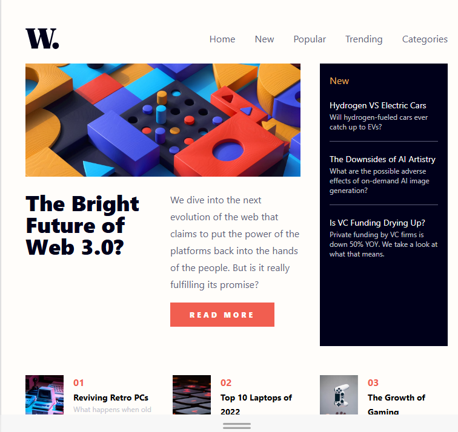

# Frontend Mentor - News homepage

---  
## Overview 
This is my solution to the Frontend Mentor News Homepage challenge. It was a challenge to different layout for device screen sizes. 

## Screenshot
Below is a preview of the solution.
 
## Links 
- **GitHub Repository:** [View Code](https://github.com/siddik-rahman/news-homepage-main)
- **Live Site:** [Live Site](https://siddik-rahman.github.io/news-homepage-main/)  
---  
## Built with 
- HTML5
- Tailwind CSS
- CSS Grid
- Mobile-first workflow 
- Responsive Web Design  
--- 
## what I Learned 
 While working on this project, I learned:
- How to use Tailwind CSS utilities classes 
- How to build a responsive layout with Tailwind CSS 
- How to use JavaScript event listeners & classList to show and hide elements 

## AI Collaboration 
AI was used as a  learning and debugging assistant while working on this project.
- Debugging 
- Brain storming 
- Nested grid layout 
## Author 
- **Siddik Rahman** 
- GitHub: [@siddik-rahman](https://github.com/siddik-rahman) 
## Acknowledgments 
Thanks to **Frontend Mentor** for providing this excellent challenge to improve my frontend development skills.

